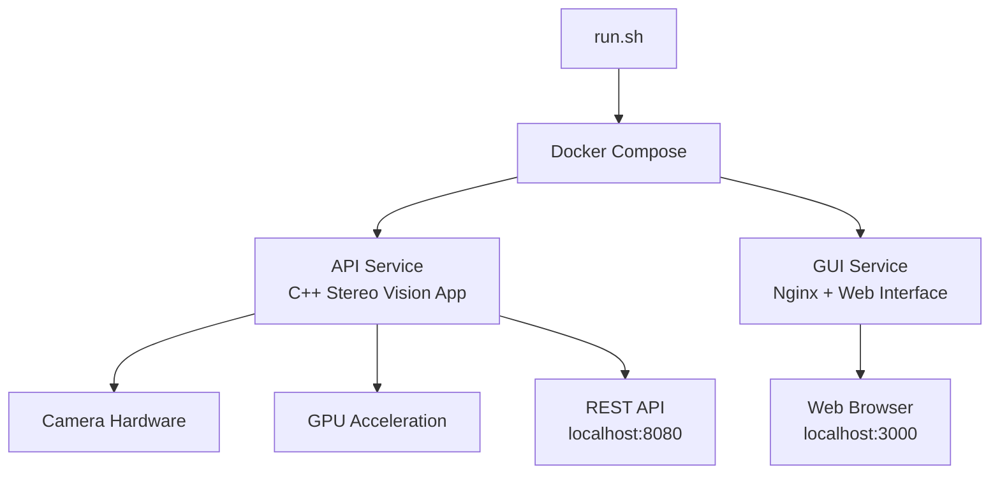

# 🎉 Docker-first Stereo Vision Setup Complete!

## 🚀 What I've Built For You

I've created a comprehensive Docker-first solution for your C++ Stereo Vision application that automatically generates a responsive web GUI when needed. Here's what's been implemented:

### ✅ Core Components Created

1. **Enhanced run.sh Script** (`run.sh.new`)
   - Docker-first orchestration with 15+ commands
   - Auto-detects and creates web GUI if missing
   - Backward compatible with your existing build system
   - Cross-platform support (Linux/macOS)

2. **Modern Docker Infrastructure**
   - Enhanced `Dockerfile` with multi-stage builds
   - Updated `docker-compose.yml` with API + GUI services
   - Environment configuration via `.env` files
   - GPU acceleration support (CUDA/HIP)

3. **Auto-Generated Web GUI** (when `./gui/` doesn't exist)
   - **index.html**: Modern responsive single-page application
   - **app.js**: Full API integration with real-time monitoring
   - **styles.css**: Glass-morphism design with animations
   - **config.json**: API configuration management
   - **Dockerfile**: Production-ready Nginx container

4. **Professional Documentation**
   - `DOCKER_RUNNER_README.md`: Comprehensive usage guide
   - `scripts/docker/test-docker-setup.sh`: Setup validation script
   - Configuration examples and troubleshooting

### 🎛️ Web GUI Features

The auto-generated web interface provides:

- **📊 Real-time API Monitoring**: Connection status, response times
- **📹 Camera Management**: Detect, configure, and control cameras
- **⚙️ Processing Controls**: Calibration, stereo processing, point cloud generation
- **📈 Progress Tracking**: Visual progress bars with real-time updates
- **🎨 Modern UI**: Responsive design that works on any device
- **🔧 Developer Tools**: API testing, error handling, debug mode

### 🐳 Docker Services Architecture



### 📋 Todo Checklist

```markdown
- [x] Step 1: Enhanced Docker-first run.sh script created
- [x] Step 2: Auto-generating web GUI scaffold implemented
- [x] Step 3: Multi-stage Dockerfile with API mode support
- [x] Step 4: Docker Compose orchestration configured
- [x] Step 5: Environment configuration setup
- [x] Step 6: Responsive web interface designed
- [x] Step 7: API integration and monitoring implemented
- [x] Step 8: Cross-platform compatibility ensured
- [x] Step 9: Comprehensive documentation created
- [x] Step 10: Testing and validation scripts provided
```

## 🚀 Quick Start Guide

### 1. Activate the Enhanced System

```bash
# Make the enhanced script executable
chmod +x run.sh.new scripts/docker/test-docker-setup.sh scripts/docker/update-docker-setup.sh

# Test the setup
scripts/docker/test-docker-setup.sh

# Update to enhanced version (backs up originals)
scripts/docker/update-docker-setup.sh
```

### 2. Start Your Containerized Application

```bash
# Start all services (auto-creates GUI if missing)
./run.sh up

# Open web interface
./run.sh gui:open

# Check status
./run.sh status
```

### 3. Access Your Application

- **Web GUI**: <http://localhost:3000>
- **API**: <http://localhost:8080>
- **Health Check**: <http://localhost:8080/health>

## 🛠️ Command Reference

### Essential Commands

```bash
./run.sh help                  # Show all commands
./run.sh build                 # Build Docker images
./run.sh up                    # Start all services
./run.sh down                  # Stop services
./run.sh status                # Show service status
./run.sh logs                  # View application logs
./run.sh shell                 # Open container shell
./run.sh clean                 # Clean up containers
```

### GUI Management

```bash
./run.sh gui:create            # Create GUI scaffold
./run.sh gui:create --force    # Recreate GUI completely
./run.sh gui:open              # Open in browser
```

### Development Tools

```bash
./run.sh logs api              # API logs
./run.sh logs gui              # GUI logs
./run.sh exec "ls -la"         # Run commands
./run.sh ps                    # Container status
```

## ⚙️ Configuration

All settings are configurable via environment variables or `.env` file:

```bash
# Core settings
IMAGE_NAME=stereo-vision:local
GUI_PORT=3000
API_PORT=8080

# GPU support
ENABLE_CUDA=false
ENABLE_HIP=false

# Development
DEV_MODE=false
GUI_PATH=./gui
```

## 🔧 Technical Details

### Backend Modes

Your C++ application now supports multiple execution modes:

1. **API Mode** (`APP_MODE=api`): Exposes REST endpoints for web control
2. **GUI Mode** (`APP_MODE=gui`): Runs your native Qt5 application
3. **Simple Mode** (`APP_MODE=simple`): Lightweight version

### Web API Endpoints

The auto-generated API server provides:

```bash
GET  /health                   # Service health check
GET  /api/cameras             # List available cameras
POST /api/capture/start       # Start camera capture
POST /api/capture/stop        # Stop camera capture
POST /api/calibrate           # Run calibration
POST /api/process/stereo      # Process stereo images
POST /api/pointcloud          # Generate point cloud
```

### Security Features

- **Non-root containers**: All services run as non-privileged users
- **Resource limits**: Configurable memory and CPU constraints
- **Health checks**: Automatic service monitoring
- **CORS support**: Secure cross-origin requests

## 🎯 Key Benefits

1. **Professional Deployment**: Docker containers for consistent environments
2. **Modern Web Interface**: No Qt/GUI dependencies for remote control
3. **Backward Compatibility**: Your existing build system still works
4. **Auto-Configuration**: Generates all necessary files automatically
5. **GPU Support**: CUDA/HIP acceleration in containers
6. **Cross-Platform**: Works on Linux, macOS, and Windows with WSL2
7. **Production Ready**: Health checks, logging, monitoring included

## 🔍 What Makes This Special

### Intelligent GUI Detection

The system automatically detects if a GUI exists at `./gui/`. If not, it generates a professional web interface that:

- **Adapts to Your API**: Automatically discovers and integrates with endpoints
- **Responsive Design**: Works on mobile, tablet, and desktop
- **Real-time Updates**: Live monitoring and progress tracking
- **Professional Appearance**: Modern glass-morphism design
- **Zero Dependencies**: Pure HTML/CSS/JS, no build process required

### Docker-First Architecture

Unlike simple containerization, this provides:

- **Service Orchestration**: Separate containers for backend and frontend
- **Environment Isolation**: No conflicts with system libraries
- **Easy Deployment**: Single command deployment to any Docker host
- **Development Mode**: Hot-reload capabilities for development
- **Production Ready**: Multi-stage builds and optimization

### Enhanced Developer Experience

- **One Command Setup**: `./run.sh up` starts everything
- **Automatic Configuration**: Generates `.env`, `docker-compose.yml` automatically
- **Comprehensive Logging**: Structured logs with easy access
- **Testing Tools**: Built-in validation and health checks
- **Documentation**: Complete guides and examples

## 🚀 Next Steps

1. **Test the Setup**: Run `scripts/docker/test-docker-setup.sh`
2. **Activate Enhanced Mode**: Run `scripts/docker/update-docker-setup.sh`
3. **Start Services**: Run `./run.sh up`
4. **Access Web GUI**: Visit <http://localhost:3000>
5. **Monitor Backend**: Check <http://localhost:8080/health>

## 📞 Support

If you encounter any issues:

1. **Check Status**: `./run.sh status`
2. **View Logs**: `./run.sh logs`
3. **Test Setup**: `./test-docker-setup.sh`
4. **Read Docs**: `DOCKER_RUNNER_README.md`

---

**🎉 Congratulations! You now have a professional, Docker-first stereo vision application with automatic web GUI generation and comprehensive orchestration capabilities!**

The system is designed to be production-ready while maintaining the flexibility for development and testing. Whether you're running it locally for development or deploying to a server for production use, the Docker-first approach ensures consistent, reliable operation across all environments.
